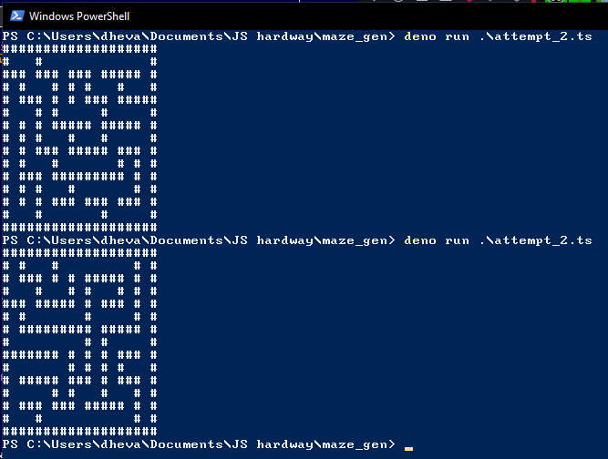

# Maze Generator

An orthogonal maze generator written in TypeScript.

## File list

`attempt_1.ts` contains the 1-dimensional array translated directly from StanislavPetrovV's code.

`attempt_2.ts` contains the 2D array implementation based on `attempt_1.ts`

## References

I translated this code from:

https://github.com/StanislavPetrovV/Maze_Game

Complete video explanation:

**Python Maze Generator. Depth-First Search** ( https://www.youtube.com/watch?v=Ez7U6jU0q5k )

